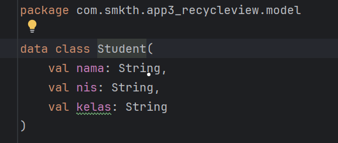
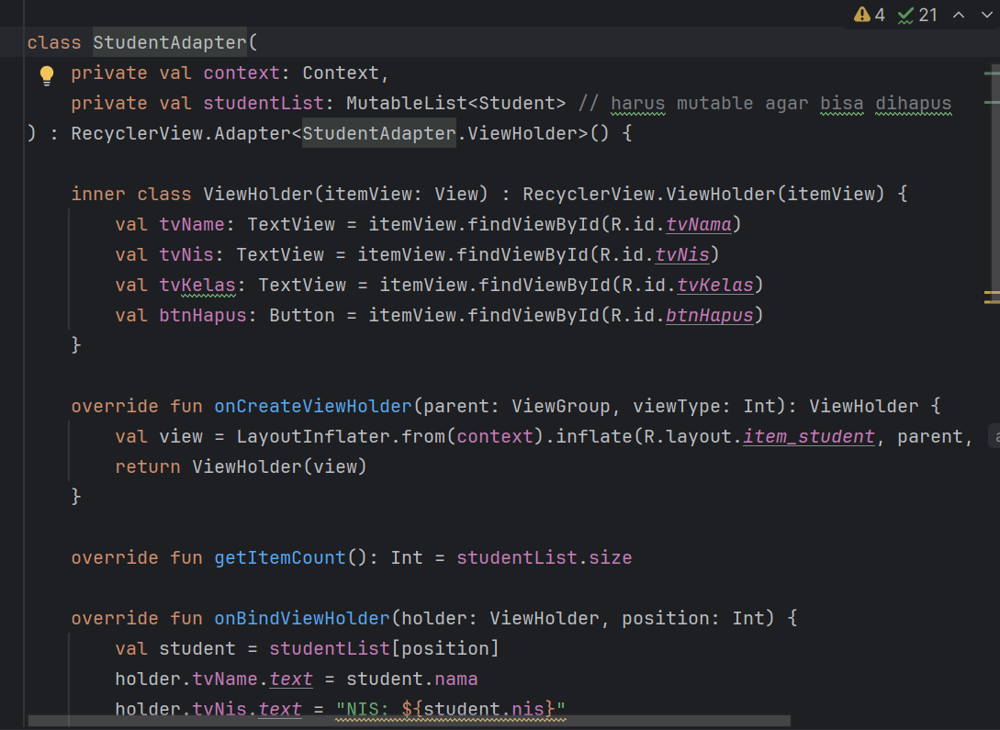
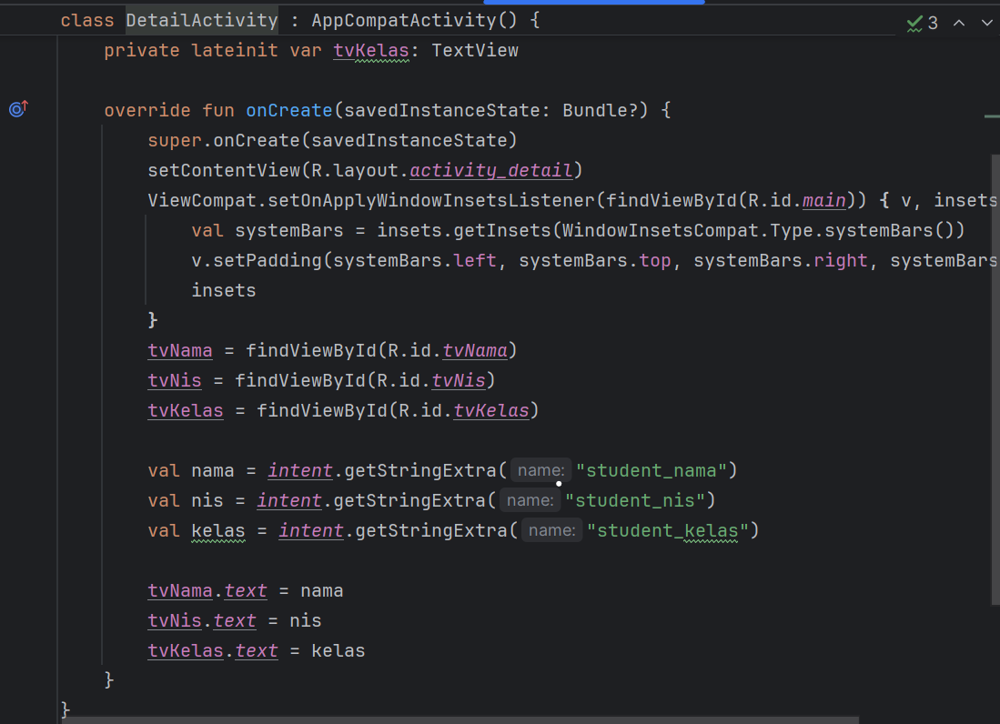
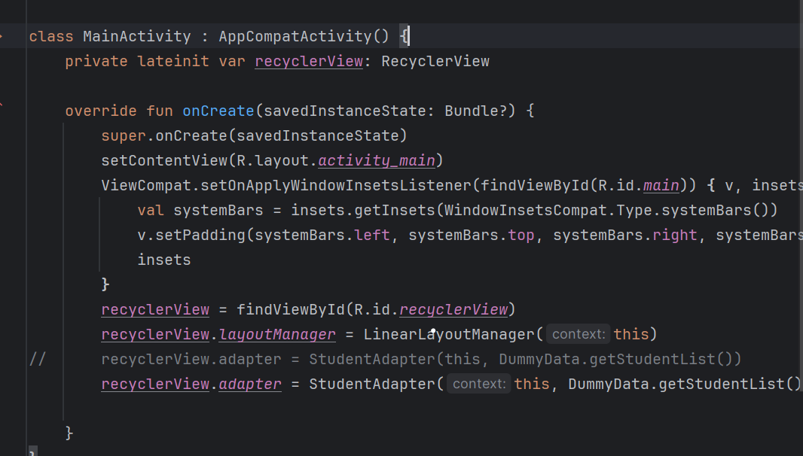

Fitur  yang sudah ada:
- List data diri siswa
- Pilih salah satu data diri siswa
- Lihat detail data diri siswa
- Hapus data siswa

Cara  kerja RecyclerView
RecyclerView bekerja dengan menampilkan data dalam bentuk daftar secara efisien menggunakan
tiga komponen utama:
1. Model sebagai struktur data,
2. Adapter sebagai penghubung antara data dan tampilan,
3. ViewHolder untuk mengelola tampilan tiap item,
   serta sistem recycle view yang mendaur ulang tampilan item yang tidak terlihat agar tidak dibuat
   ulang dari awal. RecyclerView juga menggunakan LayoutManager (seperti LinearLayoutManager atau GridLayoutManager)
   untuk mengatur posisi item, dan dapat dipadukan dengan fitur interaktif seperti klik, hapus, edit, atau search,
   menjadikannya fleksibel dan efisien untuk daftar panjang.

Penjelasan Alur Data
1. Model: File ini adalah class yang menyimpan struktur data tiap siswa
   
Satu objek siswa berisi satu nama
2. Adapter: Fungsi nya menyambungkan data dari List<siswa> ke tampilan Recycle View dan 
membuat item tampilan satu per satu.
   
3. Activity:
- DetailActivity

- MainActivity

File ini mengatur semua nya:
1. Menyiapkan RecycleView
2. Membuat list data siswa
3. Menghubungkan Adapter dengan RecycleView